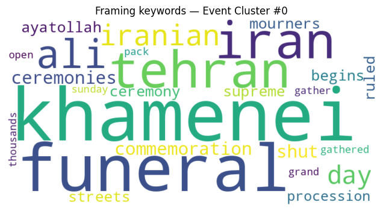
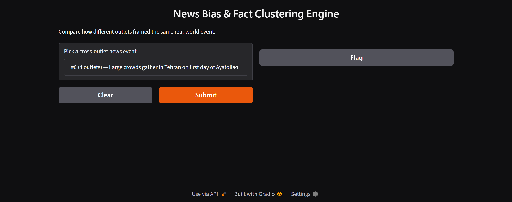

# 📰 AI-Powered News Bias & Fact Clustering Engine

An end-to-end NLP system that pulls live news articles from multiple outlets, uses semantic embeddings and unsupervised clustering to automatically group articles that cover the *same real-world event*, then quantifies how differently each outlet framed that event — tone, sentiment, subjectivity, and keyword emphasis — through an interactive Gradio dashboard.

**Google Colab Link:** https://colab.research.google.com/drive/1kirqA0fZFUIfgc-4-KA7AAmTzbtHLSss?usp=sharing

`Python` `sentence-transformers` `scikit-learn` `KeyBERT` `TextBlob` `Gradio` `feedparser`

---

## 📋 Project Details

| Field | Detail |
|---|---|
| Project Title | AI-Powered News Bias & Fact Clustering Engine |
| Type | Independent / self-directed AI-ML project |
| Duration | June 2026 – July 2026 |
| Name | Aakanksha Ekka |
| Institution | Indira Gandhi Delhi Technical University for Women (IGDTUW) |
| Course / Branch | B.Tech, Computer Science Engineering (CSE) |
| Email | aakankshaekka06@gmail.com |
| LinkedIn | https://www.linkedin.com/in/aakanksha-ekka-3b1166329/ |
| GitHub | https://github.com/AAKANKSHAEKKA/News-Bias-Fact-Clustering-Engine |
---

## 📌 Project Name
AI-Powered News Bias & Fact Clustering Engine

## 📖 Project Description

Every major news event gets covered by dozens of outlets simultaneously, but each outlet chooses its own headline, tone, and emphasis — and there's no easy way to see that side-by-side. Someone reading only one source has no visibility into how the same facts were framed elsewhere.

This project builds a pipeline that automatically:
1. Pulls live articles from 8 news outlets spanning the political spectrum via RSS
2. Converts each article into a semantic embedding and uses **unsupervised clustering** to group articles that describe the *same underlying event*, even when the wording is completely different across outlets
3. Scores each article's **sentiment polarity** and **subjectivity**
4. Extracts **framing keywords** per outlet using KeyBERT
5. Presents a side-by-side comparison report and interactive dashboard for any clustered event

The system combines **semantic search/NLP, unsupervised machine learning, and sentiment analysis** into a single reproducible Colab notebook.

## ❓ Problem Statement

Given a live stream of news articles from multiple outlets, automatically detect which articles refer to the same real-world event, and quantify how the language used to describe that event differs across sources — without any manual labeling or pre-defined "event" categories.

**Why it matters:**
- Comparing coverage of the same event across outlets manually is slow and outlet selection itself introduces bias in what a reader notices.
- Political/media bias is usually discussed qualitatively ("outlet X is biased") without any quantitative, reproducible measurement of *how* language actually differs on a specific story.
- A tone/framing signal, computed consistently across outlets, is a much more falsifiable and transparent proxy for "framing difference" than a subjective outlet-level label alone.

**ML/AI formulation:** This is a mixed pipeline — **unsupervised clustering** (grouping articles into events with no known number of clusters ahead of time) combined with **rule-based/lexicon sentiment analysis** (polarity & subjectivity scoring) and **unsupervised keyword extraction** (KeyBERT), all built on top of **dense sentence embeddings** for semantic (not keyword) matching.

## 🗂️ Data Sources

| Source | Description | Origin |
|---|---|---|
| RSS Feeds | Live headlines + summaries from 8 outlets (BBC, Reuters, NPR, The Guardian, CNN, Fox News, NY Post, Al Jazeera) | Pulled live at runtime via `feedparser`, no API key required |
| Outlet Bias Labels | Static, simplified Left/Lean Left/Center/Lean Right/Right tags per outlet | Curated in-notebook, based on commonly cited public media-bias categorizations (e.g. AllSides-style groupings) |

No dataset is stored ahead of time — every run pulls **fresh, live articles**, so results change day to day. This was a deliberate choice over using a static Kaggle dataset, to make the system behave like a real monitoring tool rather than a one-time demo.

File paths used in the notebook:
```
news-bias-clustering-engine/
├── assets/sample_sentiment_chart.png
├── assets/sample_wordcloud.png
```

## 🛠️ Tech Stack

| Category | Tools / Libraries |
|---|---|
| Language | Python 3.10+ |
| Data Ingestion | `feedparser` (RSS) |
| Data Handling | Pandas, NumPy |
| NLP / Embeddings | Sentence-Transformers (`all-MiniLM-L6-v2`) |
| Clustering | Scikit-learn (Agglomerative Clustering, cosine distance) |
| Sentiment Analysis | TextBlob (polarity & subjectivity) |
| Keyword Extraction | KeyBERT |
| Visualization | Matplotlib, WordCloud |
| Web Interface | Gradio |
| Environment | Google Colab (CPU-only, no GPU required) |

## 🧭 Project Pipeline (High-Level Flow)

```
RSS Feeds (8 outlets) ──► Fetch + Clean Text ──► Sentence Embeddings (MiniLM)
                                                          │
                                                          ▼
                                        Agglomerative Clustering (cosine distance)
                                                          │
                                    groups articles about the SAME event, regardless
                                            of outlet or exact wording used
                                                          │
                        ┌─────────────────────────────────┴─────────────────────────────────┐
                        ▼                                                                     ▼
        Sentiment + Subjectivity Scoring (TextBlob)                     Framing Keyword Extraction (KeyBERT)
                        │                                                                     │
                        └─────────────────────────────────┬─────────────────────────────────┘
                                                          ▼
                                       Event Comparison Report + Visualizations
                                                          │
                                                          ▼
                                            Interactive Gradio Dashboard
```

## 🔍 Step-by-Step Explanation of the Notebook (Cell by Cell)

The notebook is organized into 8 functional steps. Below is what each step's code actually does, and why.

### Step 0 — Setup & Dependencies
A single install cell pulls every dependency (`feedparser`, `sentence-transformers`, `scikit-learn`, `keybert`, `textblob`, `wordcloud`, `gradio`, `matplotlib`, `pandas`, `numpy`) and downloads the TextBlob NLTK corpora needed for sentiment scoring. Everything runs on CPU — no GPU runtime required.

### Step 1 — Data Ingestion (RSS Fetching)
`RSS_FEEDS` maps each outlet name to its RSS URL and a static simplified bias label.
`fetch_articles()` loops through every feed, parses each entry with `feedparser`, unescapes HTML entities, and builds a tidy DataFrame with `outlet`, `bias_label`, `title`, `summary`, `link`, and `published` columns.
Failed feeds are caught individually (`try/except` per outlet) so one broken RSS URL never crashes the whole ingestion step — it just logs a warning and moves on.

### Step 2 — Text Cleaning
`clean_text()` strips leftover HTML tags, URLs, and collapses whitespace from RSS summaries, which are often messy.
Title and cleaned summary are concatenated into one `text` field per article, and exact-duplicate / near-empty articles are dropped.

### Step 3 — Semantic Embeddings
Every article's `text` field is encoded into a 384-dimensional vector using `all-MiniLM-L6-v2`, with embeddings L2-normalized so cosine similarity reduces to a simple dot product.
This is the same embedding backbone used in semantic search systems — articles about the same event land close together in vector space even when outlets use completely different headlines.

### Step 4 — Event Clustering
`AgglomerativeClustering` is used **instead of KMeans** deliberately: KMeans requires picking the number of clusters in advance, but the number of distinct news events on any given day is unknown ahead of time.
A `distance_threshold` (tunable, default `0.35`) lets the algorithm merge articles automatically until they're no longer close enough in meaning — this is what allows the pipeline to discover event groups with zero manual labeling.
Only clusters with **2 or more different outlets** are kept as valid "cross-outlet events" — single-outlet clusters aren't useful for a framing comparison, since there's nothing to compare against.

### Step 5 — Sentiment, Subjectivity & Framing Keywords
`TextBlob` scores each article's **polarity** (-1 negative → +1 positive) and **subjectivity** (0 factual → 1 opinionated) directly from its text.
`KeyBERT`, reusing the same MiniLM model for efficiency, extracts the top 5 keyphrases (1–3 word n-grams) per article — this captures *what* each outlet chose to emphasize, independent of tone.

### Step 6 — Event Comparison Report
`show_event_report()` takes a cluster ID and prints every outlet's headline, bias label, polarity, subjectivity, and top keywords side by side, plus a "tone spread" summary (max − min polarity/subjectivity across outlets in that cluster) — a single number capturing how much framing actually varied for that story.

### Step 7 — Visualization
`plot_cluster_sentiment()` renders a horizontal bar chart of polarity per outlet, color-coded red/green for negative/positive, for any selected event cluster.
`plot_cluster_wordclouds()` builds a word cloud from the pooled KeyBERT keywords in a cluster, visually surfacing the most emphasized terms across outlets.

### Step 8 — Interactive Gradio Application
All cross-outlet clusters are wrapped into a dropdown-driven `gr.Interface`: pick an event, get the full markdown comparison report instantly.
Launched with `share=True` so anyone can access a live public demo link directly from the Colab session, without any deployment step.

## 📊 Real Output — Event Cluster #0

This is unedited output from an actual run of the notebook (July 4, 2026), clustering coverage of Ayatollah Ali Khamenei's funeral across 4 outlets:

| Outlet | Bias Label | Headline | Polarity | Subjectivity |
|---|---|---|---|---|
| Al Jazeera | Center / Intl. | Iran promotes message of continuity and revenge at Khamenei commemoration | +0.17 | 0.39 |
| Al Jazeera | Center / Intl. | Millions mourn Iran's Ali Khamenei amid historic funeral procession | +0.00 | 0.00 |
| Al Jazeera | Center / Intl. | Thousands gather as Khamenei funeral ceremonies open in Tehran | +0.05 | 0.54 |
| BBC News | Center | Large crowds gather in Tehran on first day of Ayatollah Khamenei's funeral | +0.32 | 0.59 |
| NPR News | Lean Left | Dayslong funeral for slain Supreme Leader Ayatollah Ali Khamenei begins in Tehran | +0.15 | 0.25 |
| The Guardian | Lean Left | Crowds gather as six-day funeral for former Iranian supreme leader begins | +0.17 | 0.43 |
| The Guardian | Lean Left | Ali Khamenei's six-day funeral expected to draw millions in Iran | +0.06 | 0.44 |

**Tone spread across outlets:** polarity range **0.32** | subjectivity range **0.59**




**The live Gradio app**, launched directly from the notebook's last cell, lets you pick any cross-outlet event from a dropdown and pull up this same comparison interactively:



## 🏆 Key Result

On this real run, **every article in the cluster scored positive or neutral polarity** despite covering a funeral — none went negative. This is a genuine, slightly counterintuitive finding: TextBlob's lexicon-based scoring picks up on ceremonial/respectful language ("thousands gather," "mourn," "commemoration") as mildly positive, even though the underlying event is somber. It's a useful, concrete illustration of a real limitation of lexicon-based sentiment analysis (Step 5) — it measures word-level tone, not the actual emotional valence of the event being described.

The **subjectivity range (0.59) was much wider than the polarity range (0.32)** in this cluster — outlets agreed more on tone than on how opinionated vs. factual their language was. The lowest-subjectivity article (NPR, 0.25) leaned toward descriptive reporting, while the highest (BBC, 0.59) used more evaluative language, despite both scoring similarly on polarity. This is a single-cluster observation, not a general claim about outlet behavior — the notebook would need to be run across many clusters over time to say anything about outlets' typical patterns.

## ▶️ How to Run

1. Open the notebook in Google Colab (or click the **Open in Colab** badge in the repo).
2. Run all cells top to bottom (`Runtime → Run all`).
3. No API keys are required — everything runs on free public RSS feeds.
4. The final cell launches a Gradio app with a public shareable link (`share=True`).
5. To explore a specific event, select it from the dropdown in the Gradio UI, or call `show_event_report(cluster_id)` directly in a code cell for any cluster ID printed in Step 4.

## 💡 Reason for Choosing This Project

Media framing is something everyone notices anecdotally but rarely measures. This project was chosen to combine **semantic NLP (embeddings + clustering)**, which I'd already built in an earlier research-paper search engine project, with a **new, real-world application**: instead of retrieving similar documents for a query, the same embedding technique is repurposed to *discover groups* of related documents automatically — a natural next step from search into unsupervised clustering.

## 📚 What I Learned

- How to repurpose semantic embeddings originally built for search into an **unsupervised clustering** pipeline, and why Agglomerative Clustering with a distance threshold is the right tool when the number of groups isn't known in advance (unlike KMeans).
- The practical difference between **sentiment** (tone) and **bias** (slant) — and why conflating them is a common mistake in "AI bias detection" projects. This project deliberately keeps them separate and labels the bias tags as static/simplified rather than model-derived.
- A concrete limitation of lexicon-based sentiment tools: TextBlob scored a funeral cluster as net-positive because it detects word-level tone ("gather," "mourn," "ceremony") rather than real-world emotional context — worth knowing before trusting sentiment scores at face value.
- How to build a **live data pipeline** (RSS ingestion with per-source failure handling) instead of relying on a static downloaded dataset, and why that failure handling matters — RSS feeds break often.
- How reusing one embedding model (MiniLM) across two different libraries (`sentence-transformers` directly for clustering, and via `KeyBERT` for keyword extraction) keeps a pipeline both faster and more consistent than loading multiple separate models.
- How to package a multi-step analytical pipeline into an interactive Gradio demo so the output is explorable rather than a single static report.

## ✅ Conclusion

This project delivers a complete, reproducible pipeline for detecting cross-outlet news coverage of the same event and quantifying how differently that event was framed — combining semantic embeddings, unsupervised clustering, sentiment analysis, and keyword extraction into one live, interactive system. It demonstrates applied NLP and unsupervised ML skills beyond a single-technique exercise, and is suitable for a portfolio, GitHub showcase, or technical interview discussion.

## ⚠️ Special Notes

- **Not a bias-detection tool.** This project measures *language tone and emphasis*, not political slant or factual accuracy. The outlet bias labels are static, simplified, and pre-assigned — they do not change based on the analyzed article.
- **Live data, not static.** Results will differ every time the notebook is run, since it pulls whatever is currently in each outlet's RSS feed. The "Real Output" section above reflects one specific run on July 4, 2026 and will not reproduce exactly on a later run.
- **RSS feeds can break.** If any single feed URL 404s, the pipeline logs a warning and continues with the remaining outlets rather than crashing.
- **Clustering is threshold-sensitive.** The `DISTANCE_THRESHOLD` parameter directly controls how many cross-outlet clusters form; it's exposed as a tunable constant in the notebook rather than hidden.
- **Sentiment scores reflect word-level tone, not event severity.** As shown in the real output above, ceremonial coverage of somber events can score as net-positive — this is a property of lexicon-based sentiment tools in general, not a bug specific to this project.
- All project details and contact information have been updated with the author's information.
  
## 📄 License
This project is released under the [MIT License](LICENSE) — free to use, modify, and build upon with attribution.

## 🙏 Acknowledgments
Built using open-source tools: Python, Pandas, NumPy, Sentence-Transformers, Scikit-learn, KeyBERT, TextBlob, Matplotlib, WordCloud, Gradio, and feedparser.

---
 Aakanksha Ekka  
 AI/ML Enthusiast  
 aakankshaekka06@gmail.com •  https://www.linkedin.com/in/aakanksha-ekka-3b1166329/ •  https://github.com/AAKANKSHAEKKA/News-Bias-Fact-Clustering-Engine
